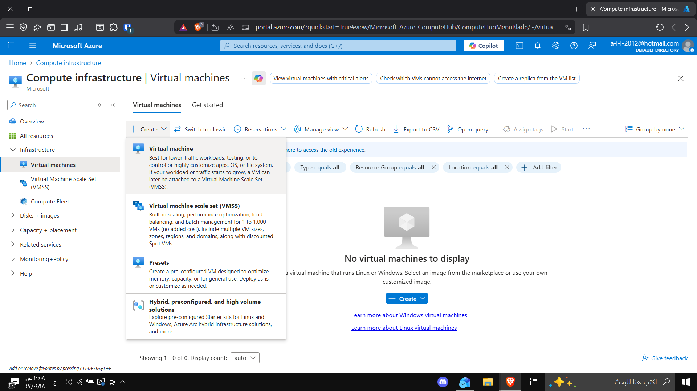
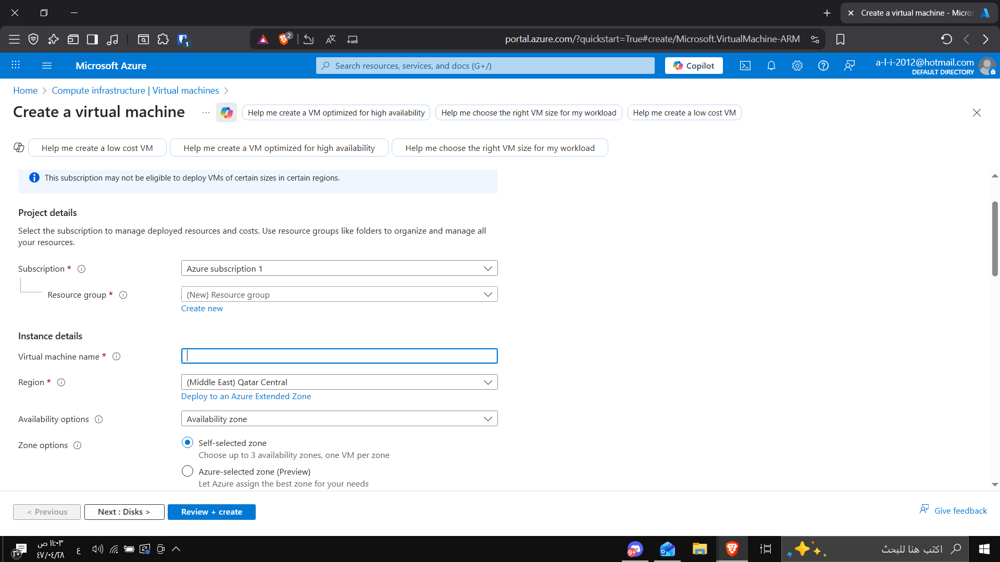
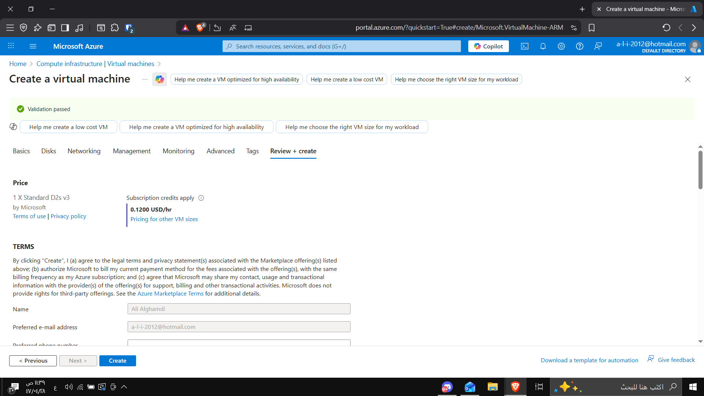
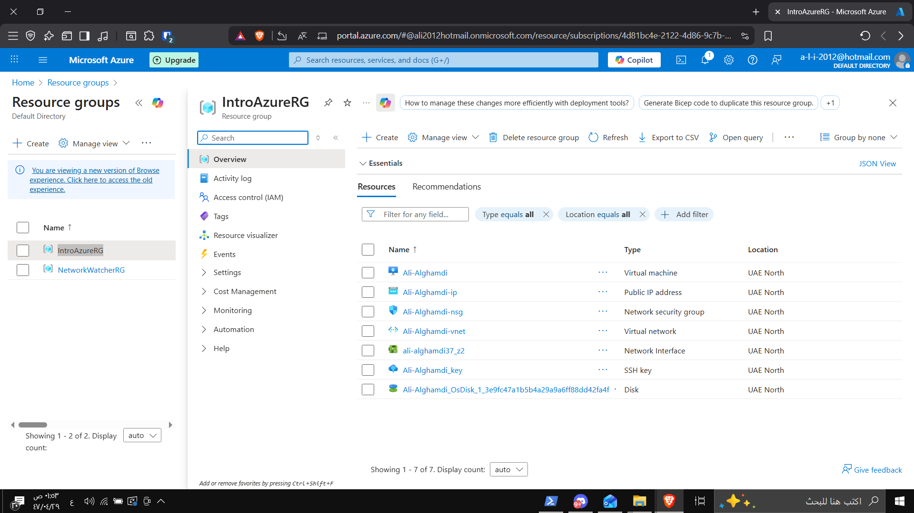

# Lab 1 - Create a Virtual Machine in Azure

## 🎯 Objective
Learn how to create a Virtual Machine (VM) and see how Azure automatically creates supporting resources such as IP, NSG, and Disk.

---

## ⚙️ Steps

1. **Open Azure Portal** → Compute → Virtual Machines → Create  
   

2. **Configure settings:**  
   - Resource Group: `IntroAzureRG`  
   - VM Name: `Ali-Alghamdi`  
   - Authentication: `Password`  
   - Inbound Ports: `None`  
   

3. **Review and Create** → Wait for deployment  
   

4. **Verify that Azure automatically created the following resources:**  
   - Network Interface  
   - Public IP  
   - Disk  
   - NSG  
   - VNet  
   

5. **Deleted the resource group** to clean up and avoid extra costs.

---

✅ **Result:** Virtual Machine was created and deleted successfully.
