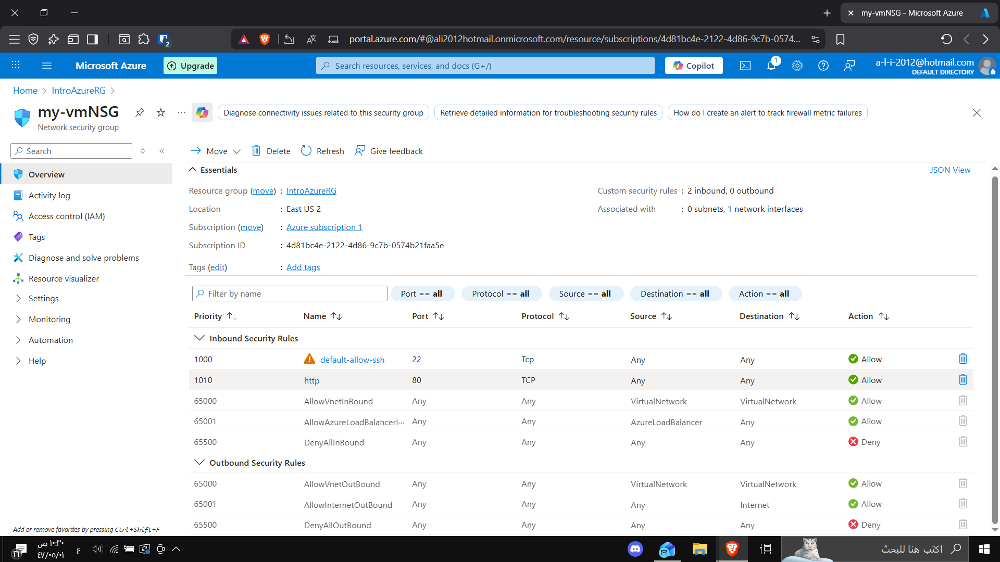

# Lab 3 - Configure Network Access

### 🎯 Objective
Configure network access to allow HTTP traffic (port 80) to the Azure virtual machine and verify that the web server is accessible from the internet.

---

### 🧩 Steps Performed

1. **Opened the Resource Group**
   - Went to `IntroAzureRG` to view all related Azure resources.
   - Located the **Network Security Group (NSG)**: `my-vmNSG`.

2. **Viewed Inbound Security Rules**
   - Verified existing rule: `default-allow-ssh` (Port 22 - TCP) → Allows SSH access for administrators only.

3. **Added a New Rule for HTTP**
   - Created a new inbound rule:
     - **Name:** `http`
     - **Port:** `80`
     - **Protocol:** `TCP`
     - **Action:** `Allow`
     - **Priority:** `1010`
     - **Source:** `Any`
     - **Destination:** `Any`

4. **Validated the Configuration**
   - Confirmed both rules:
     - `default-allow-ssh` → Port 22 ✅  
     - `http` → Port 80 ✅  
   - Refreshed the web page using the VM’s public IP and successfully loaded the custom page.

---

### 🌐 Result
The web server is now publicly accessible through port 80:  
`http://<your-public-ip>`

✅ Example Output:  
> **Welcome to Azure! I am Ali Alghamdi**

---

### 📸 Screenshot
`ex31.png`

---

### 🧠 Summary
By configuring an inbound rule in the NSG, external users can now access the web server hosted on the Azure VM.  
This lab demonstrates how **Network Security Groups (NSGs)** control inbound and outbound traffic using port-based rules.
