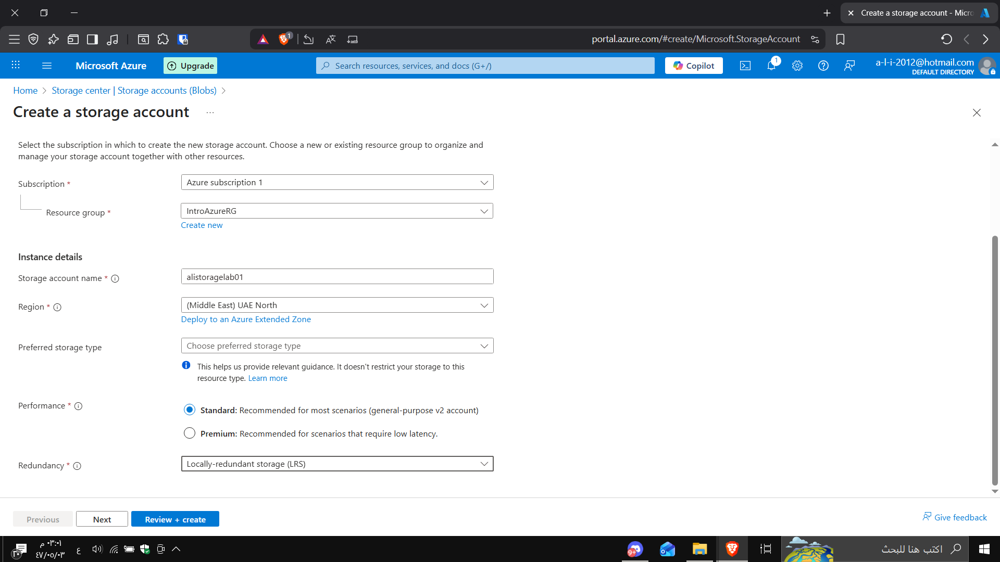
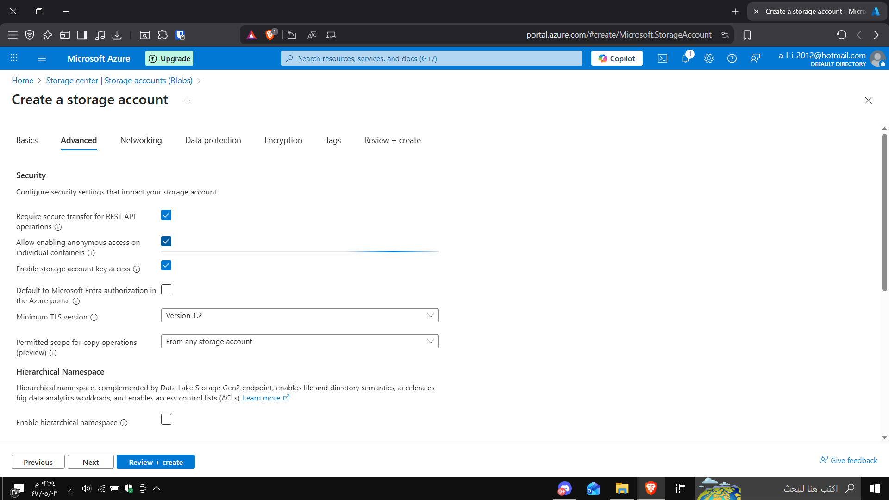
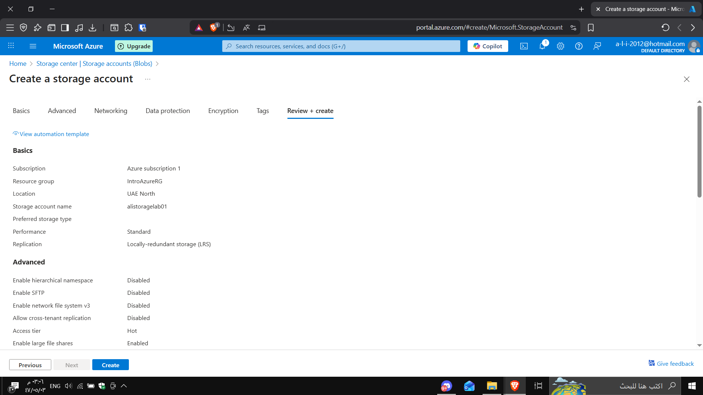
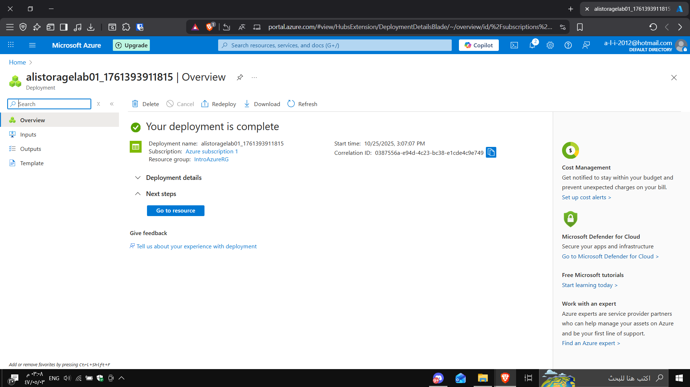
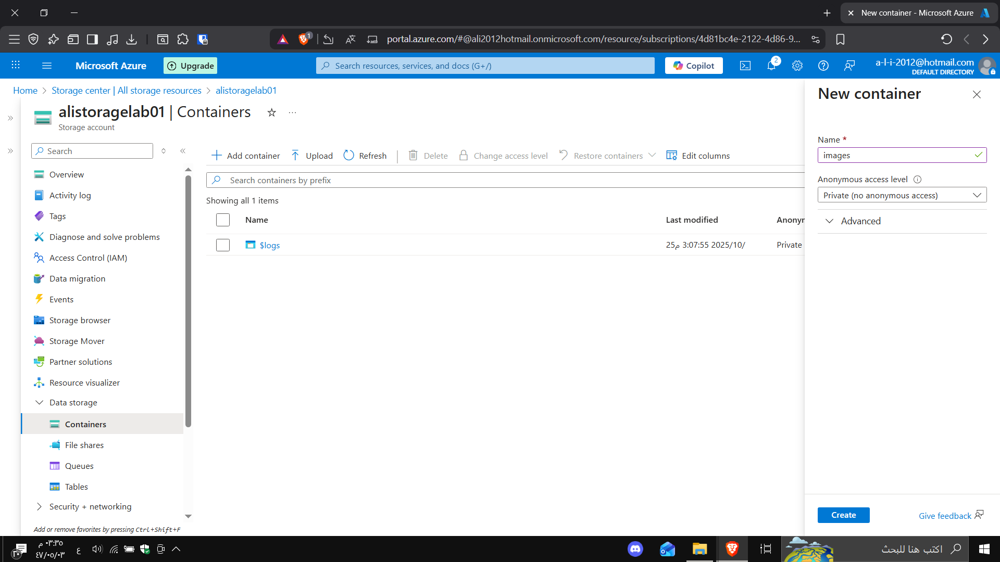
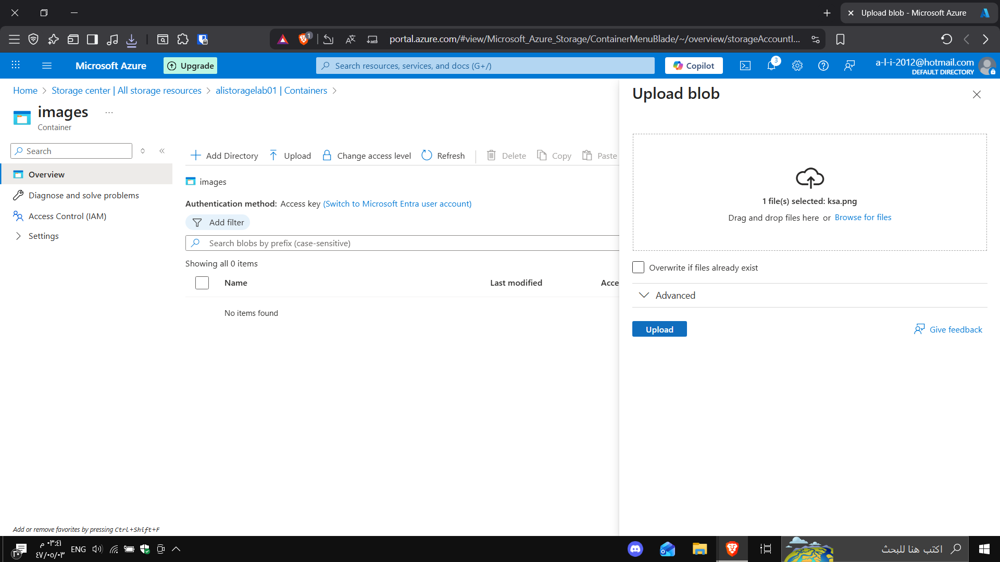
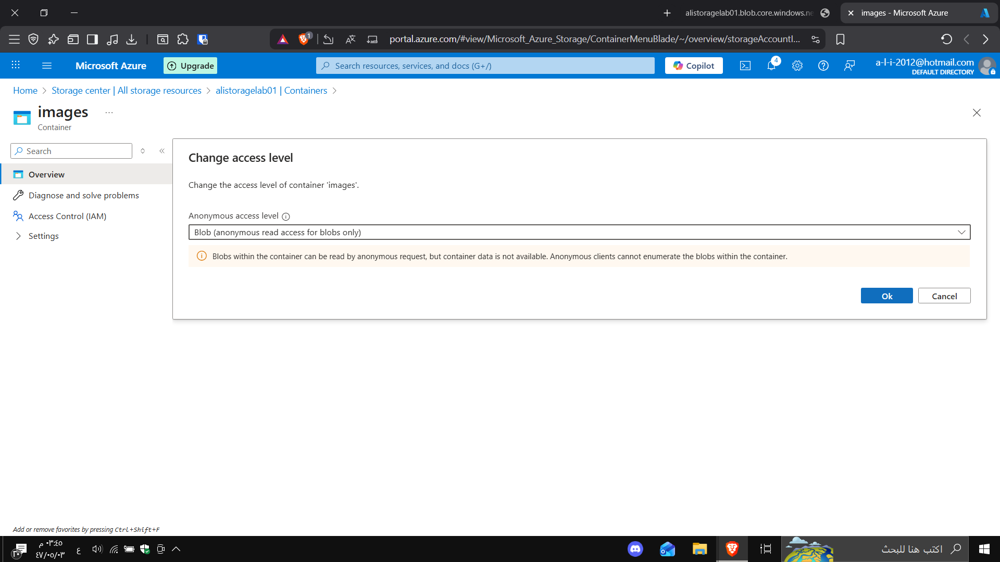
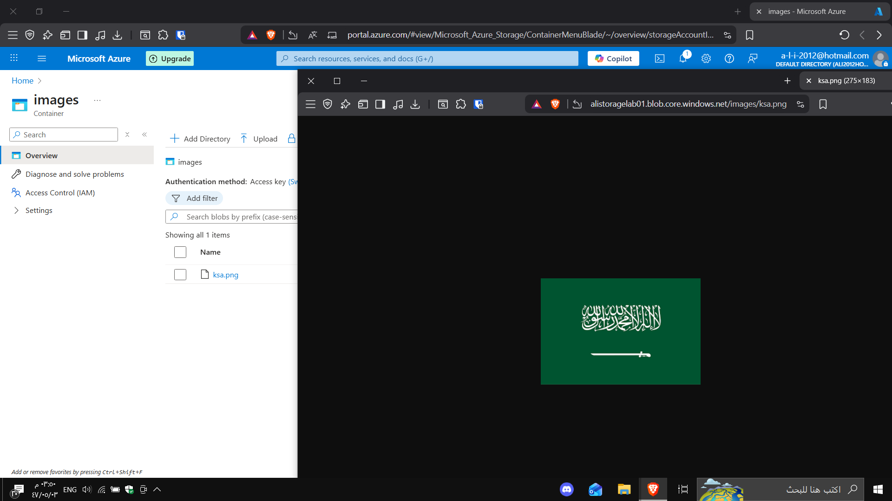

# Lab 4 - Azure Blob Storage

In this lab, I created and configured an Azure Storage Account, then uploaded a blob (image) and made it publicly accessible.

## Steps

1. **Create a Storage Account**
   - Resource Group: `IntroAzureRG`
   - Storage Account Name: `alistoragelab01`
   - Region: `UAE North`
   - Performance: `Standard`
   - Redundancy: `LRS (Locally Redundant Storage)`

   

2. **Configure Advanced Settings**
   - Enabled secure transfer
   - Allowed anonymous access on containers

   

3. **Review and Create**
   

4. **Deployment Completed**
   

5. **Create Container**
   - Name: `images`
   - Access level: Private (initially)

   

6. **Upload Blob**
   - File: `ksa.png`

   

7. **Change Access Level**
   - To: `Blob (anonymous read access for blobs only)`

   

8. **Test Public Access**
   - URL: [ksa.png](https://alistoragelab01.blob.core.windows.net/images/ksa.png)

   

---

✅ **Result:**  
The image is publicly accessible through Azure Blob Storage.

🌍 **Public link:**  
[https://alistoragelab01.blob.core.windows.net/images/ksa.png](https://alistoragelab01.blob.core.windows.net/images/ksa.png)
