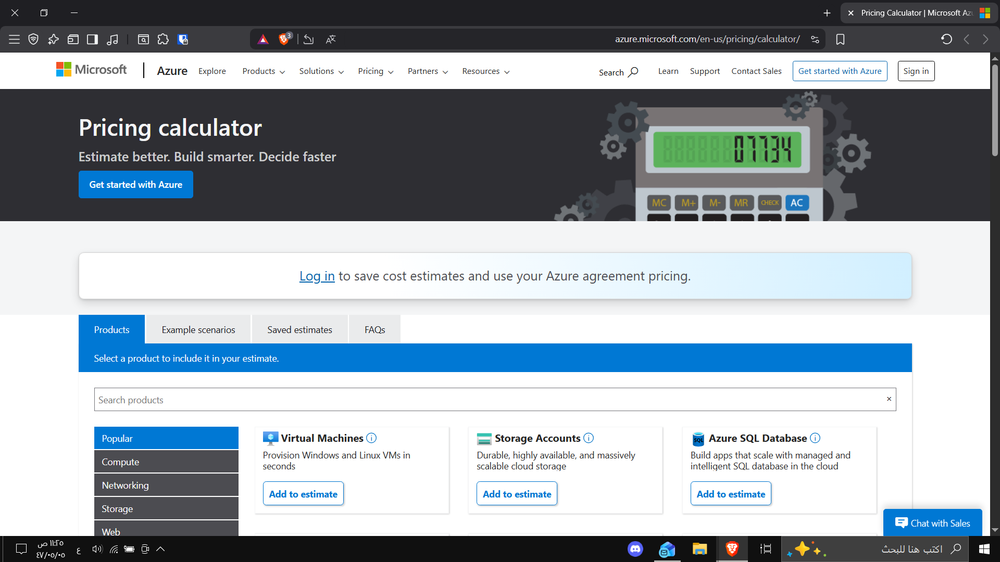
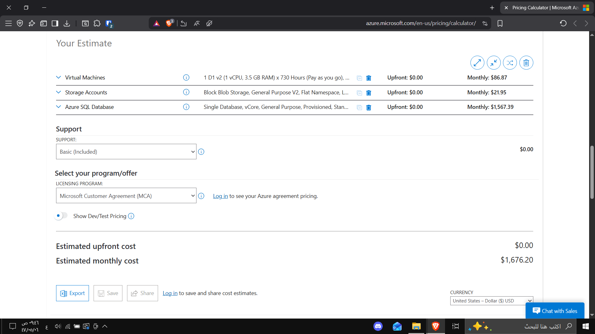

# 💰 Azure Pricing Calculator Exercise

## 🎯 Objective
Estimate the monthly cost of hosting a basic web application on **Microsoft Azure** using the **Pricing Calculator**.

---

## 🧱 Services Used
1. **Virtual Machines (Compute)**  
   - Region: West US  
   - OS: Windows  
   - Type: (OS Only)  
   - Tier: Standard  
   - Instance: D1 v2  
   - Quantity: 2 × 730 hours  

2. **Storage Account**  
   - Region: West US  
   - Type: Block Blob Storage  
   - Performance: Standard  
   - Access Tier: Hot  
   - Redundancy: LRS  
   - Storage Account Type: General Purpose v2  

3. **Azure SQL Database**  
   - Region: West US  
   - Type: Single Database  
   - Purchase Model: vCore  
   - Service Tier: General Purpose  
   - Compute Tier: Provisioned  
   - Generation: Gen5  
   - Instance: 8 vCore  

---

## 📊 Estimated Cost
| Service | Monthly Cost (USD) |
|----------|--------------------|
| Virtual Machines | $86.87 |
| Storage Account | $21.95 |
| Azure SQL Database | $1,567.39 |
| **Total** | **$1,676.20 / month** |

---

## 📷 Screenshots
### 1️⃣ Services Selection

### 2️⃣ Cost Estimation Summary

---

## 🧠 Learning Outcome
- Understood how to use the **Azure Pricing Calculator**.  
- Learned how **region, type, and performance tier** affect costs.  
- Estimated the **total monthly cloud expense** before deployment.

---

## 🔑 Keywords
`Azure` `Pricing Calculator` `Compute` `Storage` `SQL Database` `Cost Estimation` `Cloud Economics`

---

🧾 *This exercise is based on the official Microsoft Learn module: “Exercise - Estimate workload costs by using the Pricing calculator.”*
