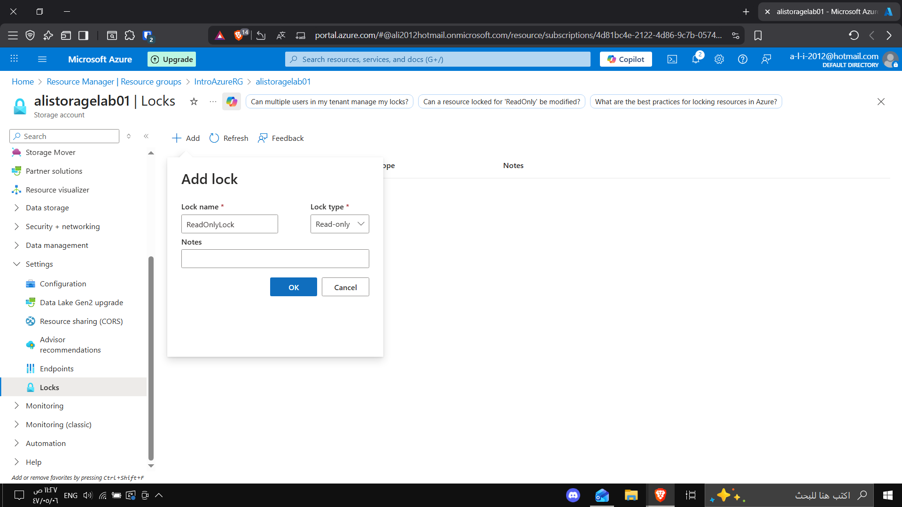
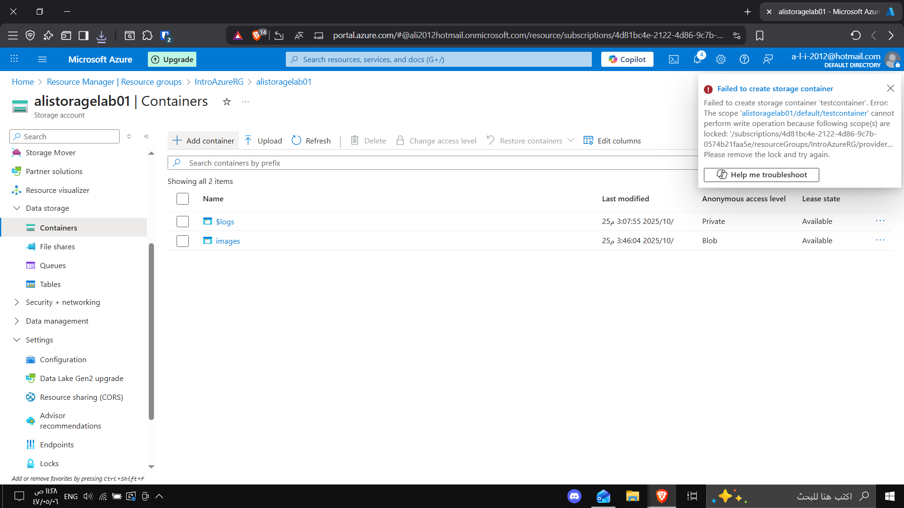
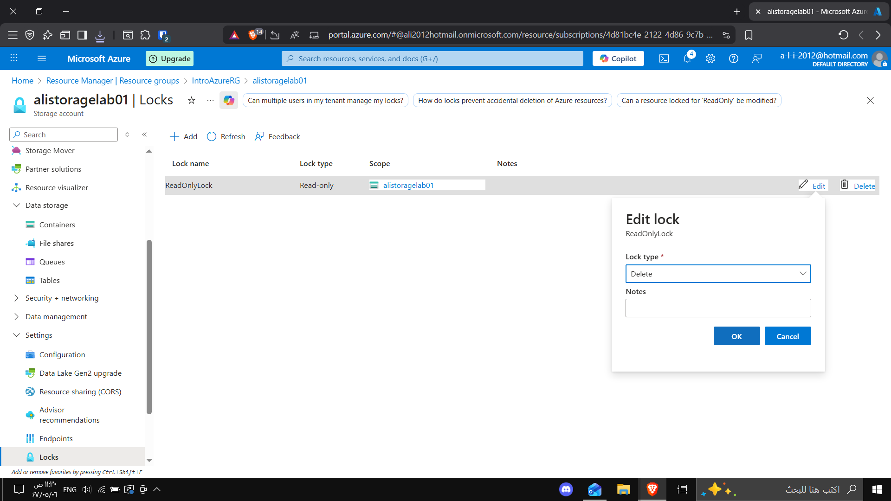
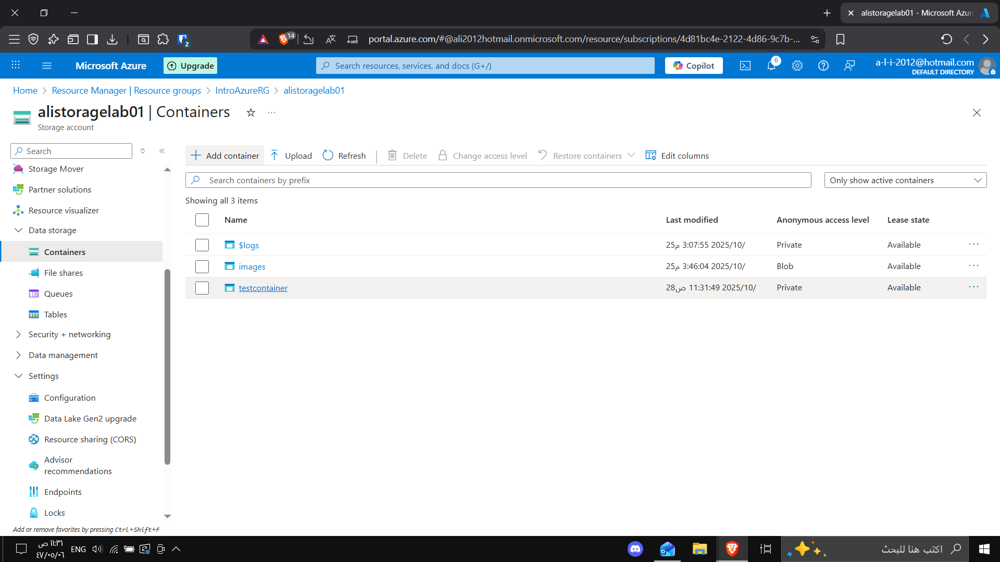
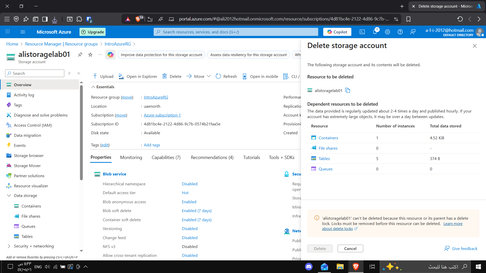

# 🔒 Lab 6 - Configure a Resource Lock in Azure

This lab demonstrates how to use **Azure Resource Locks** to protect resources from accidental modification or deletion.

---

## 🧩 Overview
A **Resource Lock** provides an extra layer of protection to critical Azure resources.  
Even users with Owner permissions must remove the lock before deleting or changing a resource.

---

## 🧠 Objectives
- Create a new Azure Storage Account  
- Apply a **Read-only Lock**  
- Attempt to modify the resource (and observe failure)  
- Change the lock to **Delete** type  
- Successfully create a container  
- Attempt to delete the resource (blocked by the lock)  

---

## 🧪 Steps

### 🧱 Step 1: Create a Storage Account
Created a new storage account named **alistoragelab01**.  

---

### 🔒 Step 2: Add a Read-only Lock
Added a new lock named **ReadOnlyLock** and selected **Read-only**.  

---

### 🚫 Step 3: Try to Create a Container (Fails)
Attempted to add a new container → Failed due to the Read-only lock.  

---

### ✏️ Step 4: Change Lock Type to Delete
Modified the lock type from **Read-only** to **Delete**.  

---

### ✅ Step 5: Create a Container Successfully
Now, container creation succeeded since delete lock allows changes.  

---

## 📊 Result
- The **Read-only lock** prevented write operations.  
- The **Delete lock** prevented resource deletion.  
This ensures that critical resources remain safe from accidental changes.

---

**Created by:** Ali Alghamdi  
**Lab:** AZ-900  
**Tool Used:** Azure Portal  
**Date:** October 2025
